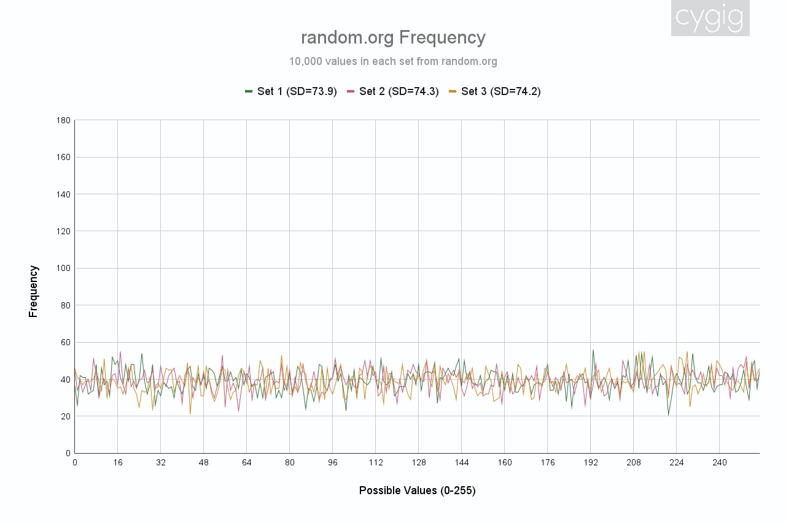
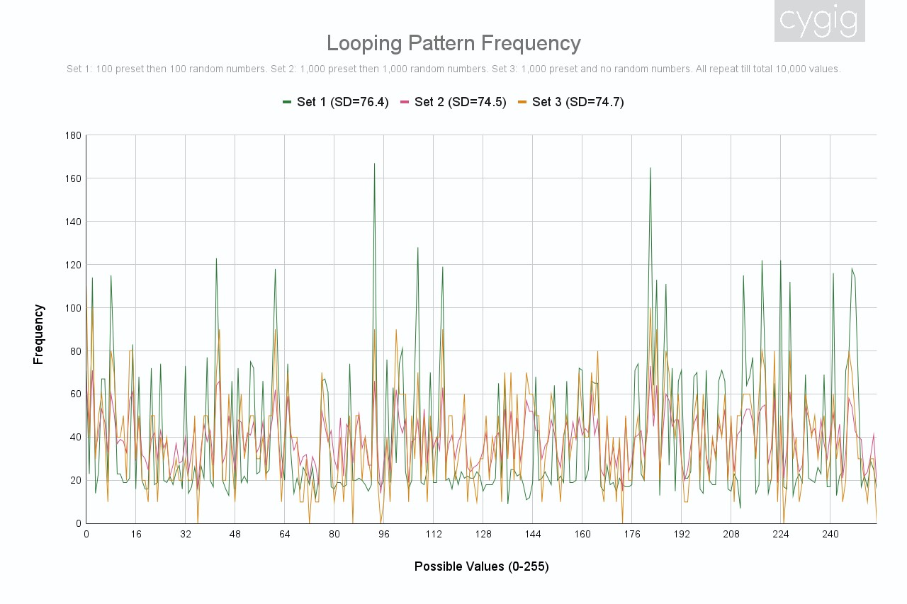
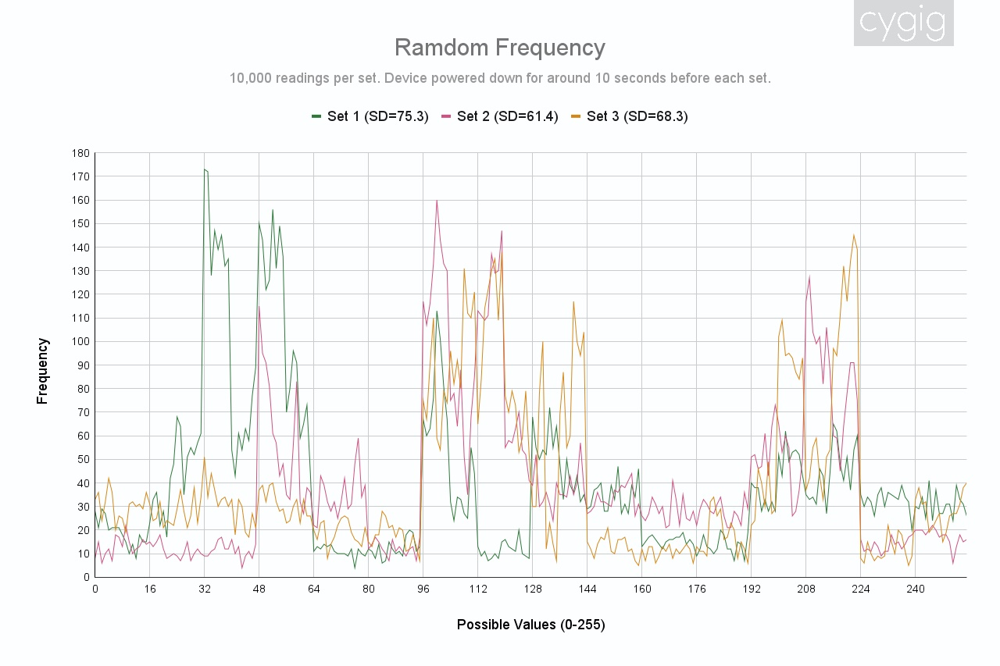
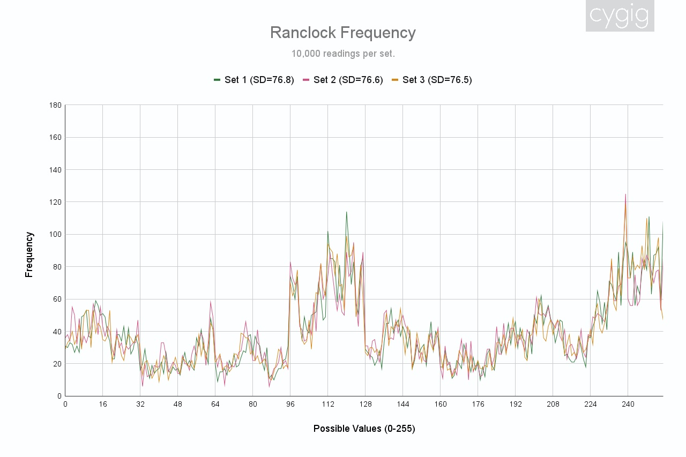
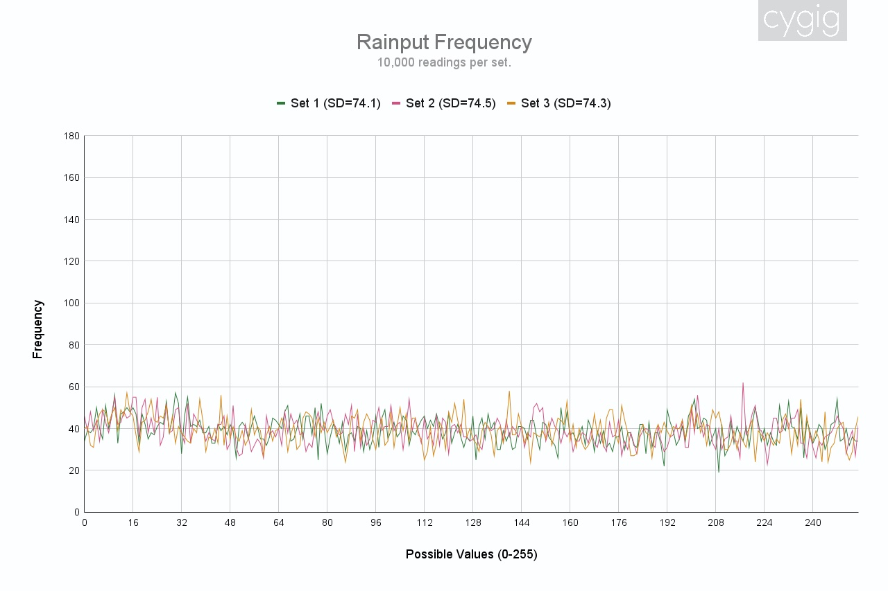
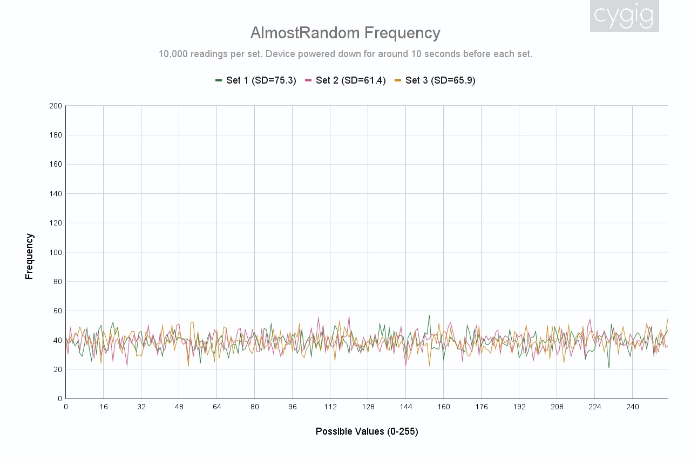

# AlmostRandom

The AlmostRandom library provides a versatile and unique approach to generating random numbers on Arduino microcontrollers. Unlike traditional methods that rely solely on hardware noise or pseudo-random algorithms, AlmostRandom combines multiple sources of entropy to produce unpredictable and chaotic random numbers suitable for casual, recreational, and non-critical applications.

This library harnesses various sources of randomness, including the parity of analogRead() values, the contents of RAM, and the values of internal timers. By combining these diverse sources, AlmostRandom creates a robust and unpredictable stream of random numbers that are ideal for tasks where high cryptographic strength is not required.

AlmostRandom serves as a compelling alternative to the built-in random() function, offering increased entropy and randomness. While the random() function employs pseudo-random algorithms, AlmostRandom leverages genuine hardware randomness, resulting in more chaotic and unpredictable outputs.

Please note that AlmostRandom is designed for non-critical applications and may not be suitable for tasks requiring high levels of cryptographic strength or security. However, for hobbyist projects, simulations, games, and other recreational purposes, AlmostRandom provides an excellent balance of unpredictability and ease of use.


# Contents
- [Updates](#updates)
- [Disclaimer](#disclaimer)
- [Compatible Hardware](#compatible-hardware)
- [Random Numbers](#random-numbers)
  - [Evaluating Random Numbers](#evaluating-random-numbers) 
  - [Ranalog: Mix things up for analogRead!](#ranalog-mix-things-up-for-analogread)
  - [Ramdom: Chaotic RAM](#ramdom-chaotic-ram)
  - [Ranclock: The Clock Jitters](#ranclock-the-clock-jitters)
  - [Rainput: Imprecise Humans](#rainput-imprecise-humans)
  - [AmostRandom: Altogether Now!](#amostrandom-altogether-now)
  - [Speed](#speed)
- [Public Functions](#public-functions)
- [Extra: Setup Photos](#extra-setup-photos)
- [Extra: Manual Setup for Ramdom and Ranclock](#extra-manual-setup-for-ramdom-and-ranclock)

# Updates

- 0.10.0
	- Finished implementing most methods.
- 0.6.0
    - Implemented Ranalog methods.

# Disclaimer

This library is meant for educational and recreational use only, do not use the random numbers generated by this library for critical and high-stake use cases like encryption and important decisions.

There maybe inaccurate or incomplete information regarding random numbers, like their nature, generation, usage and testing methods. I seek your forgiveness and understanding as I am not an expert in random numbers or microcontrollers.

## Compatible Hardware
This library primarily targets and is compatible with:
| Board           | MCU        | Core             |
|-----------------|------------|------------------|
| Arduino Uno R3  | ATmega328P | Official Arduino |
| Arduino Leonardo| ATmega32u4 | Official Arduino |
| Arduino Mega    | ATmega2560 | Official Arduino |
| My DIY Dev Board| ATtiny 3224/3226/3227 | [megaTinyCore](https://github.com/SpenceKonde/megaTinyCore) |

Feel free to try


# Random Numbers
There are generally two kinds of random numbers: true random or pseudo-random. Some examples of true random sources include radioactive decay, atmospheric electrical noises and some quantum phenomena. They are not the easiest to harvest and processed into random numbers in a typical home setting.

As such, for non-critical tasks, pseudo-random numbers are used. They are often generated from a formula using a seed as a starting condition. 

An example of such formula is the Middle-Square method. If `123` is used as a seed and squared, the answer will be `15129`. We can then extract the middle three digits of `15129`to use as our random number, which will be `512`. `512` can then be used as a seed for the next random number.

One commonly used seed is the Unix Time, or the number of seconds passed since 1 January 1970, which has the advantage of being unique every second.

One major problem with pseudo-random numbers is that if one knows the seed and the formula, you can predict the outcome. Poor formula may also result in pseudo-random number looping in a sequence.

There are also methods that are in-between. A coin toss may seem random but if one knows all the initial conditions for the toss, they will be able to predict the outcome. However due to how unpredictable and chaotic a casual coin toss is, it is practically random for a day-to-day non-critical use case. This library aim to deliver such numbers between true and pseudo-random. 

Instead of generating random numbers from one source, this library will also be using various sources of not-so-ideal random numbers, throw them into a pool of entropy to get a better random number. 


## Evaluating Random Numbers
Evaluating the quality of random numbers is a subject require vast mathematical knowledge which I do not possess. I will try to keep things simple by looking at the frequency graph and standard deviation. 

The frequency graph shows how often a number is being generated, which gives us a clue on how each possible value (0-255, one byte, in our case) is being represented. Spikes will mean that value is over represented while dip means under represented.

Standard deviation measures the variation of a reading about its mean average, with lower number suggesting a smaller spread or better consistency.

I assume that the fairest random number generator will generated all possible values with equal chances as the number of readings approach infinity.


### Positive Example
First, I looked at some results from an existing random number generator. In my case, I chose the famous random.org. I generated three sets of 10,000 random bytes:



The graph looks well distributed and the average standard deviation is 74.1. The height of the graph fits within 20 to 60 on the Y-axis (frequency). We will use this as a sign of having good quality random numbers.

### Negative Example
On the other end, I wanted to look at how bad random numbers look like. I generated three sets of 10,000 low quality random numbers. 

The first set has
- 100 preset numbers, followed by
- 100 random numbers from random.org, followed by
- The same 100 preset numbers, followed by
- Freshly generated 100 random numbers from random.org
- So on until there are 10,000 numbers

The second set has a 1,000 preset/random numbers in similar fashion as the first.

The third set as 1,000 preset numbers looping till the end of 10,000 total numbers with no random numbers.



Set 1 has obvious spikes as the preset numbers occur far more often than the random ones. Set 2 has obvious dips as some preset numbers are not represented and due to the looping nature, is not represented at all throughout.

Set 2 is the least obvious among the three, thanks to the repeating preset being larger in size.

I noted that the standard deviation does not tell us too much as the good random numbers from random.org netted us 74.1 while the horrible Set 1 and Set 3 is 76.4 and 74.7 respectively, not far away. I suspected a value too unreasonable will indicate larger issues with the quality of random numbers.

Lastly, this is the result from using the built-in `random()` in Arduino:
.jpg)


## Ranalog: Mix things up for analogRead!
The reading from analogRead has been a staple to use as a seed for the Arduino built-in random number generator. It usually goes like this:
```
randomSeed( analogRead(A0) );
long randNumber = random(10, 10000);
Serial.println(randNumber);
```
The idea is a floating (unconnected) pin will measure surround electromagnetic interference (EMI) to produce a random reading. However, calling `analogRead()` on the ATtint3224 10,000 times and plotting the readings seems to tell a different story:

.jpg)

It seems like less than half of the possible values from 0 to 1023 were produced at least once, and there is a discernible 'U' shape with spikes at the end. This may not even make for a good seed. The standard deviations are more than 100, making it worse than the poor quality random numbers I designed in [Evaluating Random Numbers](#evaluating-random-numbers).

Out of curiosity, I decided to look at the parity of the readings. It means seeing how many of the readings are odd and how many are even:

.jpg)

Throughout three sets of 10,000 readings, the ratios of odd to even number come close to 50:50. This effectively makes the parity of `analogRead()` on the ATtiny3224 a coin toss. A bit can be a one or zero, so if the microcontroller unit (MCU) "toss" this coin eight times, it would be able to produce one random byte (eight bits in one byte). I dub this the "Ranalog" method.

I then repeat the analogRead experiment with the Arduino Uno R3 and Arduino Leonardo:

|                    | Arduino Uno R3 | Arduino Leonardo |
|--------------------|----------------|------------------|
|analogRead Frequency| .jpg) | .jpg) |
|Parity Distribution | .jpg) | .jpg) |

Those look worse than those from the ATtiny3224 and there are way too many odd numbers and zeros for the case of Uno. Regardless, my aim is to combine various sources of not-so-ideal random numbers, hence I implemented the Ranalog to take a look:

| ATtiny3224 | Arduino Uno R3 | Arduino Leonardo |
|------------|----------------|------------------| 
| .jpg) | .jpg) | .jpg) |

ATtiny3224 has the best results, while surprisingly Leonardo has the worst, despite poorer looking distribution from Uno R3's analogRead function.

I supposed that extending the pin with a wire will make it into an antenna, and hopefully this antenna will be able to pick up EMI more randomly, as such, I attached a 6.5, 10.0cm antenna and via a breadboard. Since we can get each bit of the byte from an analog pin, I also tested out multiple antennae on as many analog in port as the developer's board allow:

| Antenna(e) | ATtiny3224 | Arduino Uno R3 | Arduino Leonardo |
|------------|------------|----------------|------------------|
| 6.5cm      | .jpg) | .jpg) | .jpg) |
| 10.0cm     | 
| Multi      |


## Ramdom: Chaotic RAM
Uninitialised random access memory (RAM) are not guaranteed to be zeros. And there doesn't seem to be any code that will zero the RAM other than where it will be used. On the internet, there are some criticism of using uninitalised RAM for random numbers, mainly:
- Uninitialised RAM are not that random and can produce looping sequences
- It is unsafe to meddle with uninitialised RAM

Regardless, I dubbed this method "Ramdom" and read the entire RAM of my ATTiny3224, XORing each byte. As the program is running, parts of the RAM that are actively in used will also contribute to the random numbers. This is what I get:



While the standard deviation is only 68.3 across three sets, the graph is way too spiky to be considered even decent. Fortunately, the spikes occur at different positions for each run, suggesting some level of unpredictability. Also, running this function multiple times never crashed the ATtiny3224, implying it is relatively safe to **read** directly from the memory addresses, uninitialised or not.

While not ideal to use alone, they can be still contribute to the entropy pool when used together with the other methods, thus I will leave it in the library.

## Ranclock: The Clock Jitters
When I asked chatGPT about clock jitters, it suggested an experiment similar to:
- Get the starting time using `micros()`.
- `delay` for 1ms (or 1000us).
- Get the ending time using `micros()`.
- Calculate ending time - starting time.

Since `micros()` measures the amount of microseconds passed since the sketch is running, doing so should result in 1000. Even if there are certain rounding errors, the number should remain the same. However, this is what I got across three different microcontrollers:

While this would be understandable if there are multiple clock sources, there is usually only one on Arduino and the timers are prescaled from the same clock source. chatGPT explained it as a combination of clock jitter, imprecise hardware and rounding errors on software. As we all know, we should never trust chatGPT entirely.

Seeing that the timers are not precise, I took the least significant 8-bits of two timers and XOR the result to give me my random number. I dub this "Ranclock":



There are spikes but they do not seem to abrupt, which may mean some ranges of number occur more often than others. Also it is a concern than all three sets are of similar shape suggesting some level of predictability. The average standard deviation across the sets is 76.7.

Similar to Ramdom, this would be kept and contribute towards the entropy pool.


## Rainput: Imprecise Humans

Human input can be one source of random number, since we humans are unlikely to perform an action precisely to the milliseconds or microseconds. Thus, we can use `millis()` and `micros()` as a source of random number tied to the moment when a user interface with the machine, usually by pressing a button.

I dub this method "Rainput". Since `millis()` and `micros()` return the time in four bytes unsigned long, I can XOR these eight bytes (four from each) to get a random byte.

Initially it seems like a repetition of Ranclock, since that deals with timers and clock as well, but the resulting graph looks different:



There are not obvious spikes and dips and the average standard deviation is 74.4, this looks like good quality random numbers. Not to mentioned the random numbers are generated back to back in a loop, which means that if they are generated based on human interaction, they would have more unpredictability.

## AmostRandom: Altogether Now!

Taking one random byte from each of the four methods, we can once again XOR them to give us the final random byte:



The average standard deviation across three sets is 74.1, which is the same as the ones from random.org. There are no obvious spikes and dips and the frequencies lies in between 20-40, just like those from random.org.

Note that for this test, the same eight-antennae setup as [mentioned above](#eightantennae) is used for Ranalog().

Obviously, more research is needed to prove the quality of these random numbers, but I would say these should be good enough for most non-critical, unimportant, causal, recreational activities requiring random numbers.

## Speed


# Public Functions
## AlmostRandom()

Constructor to initialise values. No parameters.


##  _byte_ getRandomByte()

Get a random number as a byte, from 0 to 255.

# Extra: Setup Photos
# Extra: Manual Setup for Ramdom and Ranclock

