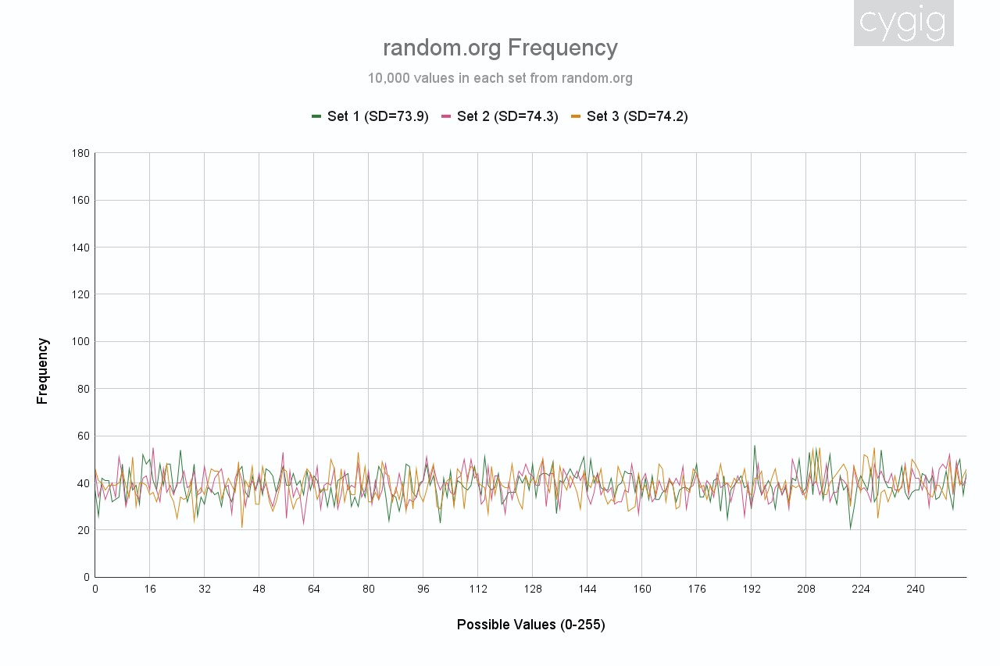

# AlmostRandom

The AlmostRandom library provides a versatile and unique approach to generating random numbers on Arduino microcontrollers. Unlike traditional methods that rely solely on hardware noise or pseudo-random algorithms, AlmostRandom combines multiple sources of entropy to produce unpredictable and chaotic random numbers suitable for casual, recreational, and non-critical applications.

This library harnesses various sources of randomness, including the parity of analogRead() values, the contents of RAM, and the values of internal timers. By combining these diverse sources, AlmostRandom creates a robust and unpredictable stream of random numbers that are ideal for tasks where high cryptographic strength is not required.

AlmostRandom serves as a compelling alternative to the built-in random() function, offering increased entropy and randomness. While the random() function employs pseudo-random algorithms, AlmostRandom leverages genuine hardware randomness, resulting in more chaotic and unpredictable outputs.

Please note that AlmostRandom is designed for non-critical applications and may not be suitable for tasks requiring high levels of cryptographic strength or security. However, for hobbyist projects, simulations, games, and other recreational purposes, AlmostRandom provides an excellent balance of unpredictability and ease of use.


# Contents
- [Updates](#updates)
- [Disclaimer](#disclaimer)
- [Compatible Hardware](#compatible-hardware)
- [Random Numbers](#random-numbers)
  - [Evaluating Random Numbers](#evaluating-random-numbers) 
  - [Ranalog: Mix things up for analogRead!](#ranalog-mix-things-up-for-analogread)
  - [Ramdom: Chaotic RAM](#ramdom-chaotic-ram)
  - [Ranclock: The Clock Jitters](#ranclock-the-clock-jitters)
  - [Rainput: Imprecise Humans](#rainput-imprecise-humans)
  - [AmostRandom: Altogether Now!](#amostrandom-altogether-now)
  - [Speed](#speed)
- [Public Functions](#public-functions)
- [Extra: Setup Photos](#extra-setup-photos)
- [Extra: Manual Setup for Ramdom and Ranclock](#extra-manual-setup-for-ramdom-and-ranclock)

# Updates

- 0.10.0
	- Finished implementing most methods.
- 0.6.0
    - Implemented Ranalog methods.

# Disclaimer

This library is meant for educational and recreational use only, do not use the random numbers generated by this library for critical and high-stake use cases like encryption and important decisions.

There maybe inaccurate or incomplete information regarding random numbers, like their nature, generation, usage and testing methods. I seek your forgiveness and understanding as I am not an expert in random numbers or microcontrollers.

# Compatible Hardware
This library primarily targets and is compatible with:
| Board            | MCU        | Core             | Default `ramStart` | Default `ramEnd` | Default `timerA`<br>`CountAddress` | Default `timerB`<br>`CountAddress` |
|------------------|------------|------------------|-|-|-|-|
| Arduino Uno R3   | ATmega328P | Official Arduino | 0x0100 | 0x08FF | 0x46 (Timer 0) | 0x84 (Timer 1) | 
| Arduino Leonardo | ATmega32u4 | Official Arduino | 0x0100 | 0x0AFF | 0x46 (Timer 0) | 0x84 (Timer 1) | 
| Arduino Mega     | ATmega2560 | Official Arduino | 0x0200 | 0x21FF | 0x46 (Timer 0) | 0x84 (Timer 1) | 
| My DIY Dev Board | ATtiny 3224/<br>3226/3227 | [megaTinyCore](https://github.com/SpenceKonde/megaTinyCore) | 0x3400 | 0x3FFF | 0x0A20 (Timer A0) | 0x0A9A (Timer B1)
| ESP32-S3-DevKitC* | ESP32S3    | Official Arduino | 0x3FC88000 | 0x3FCFFFFF | 0x6001F004 (Group 0 Timer 0, latch on 0x6001F00C) | 0x60020004 (Group 1 Timer 0, latch on 0x6002000C) |

Feel free to try other MCUs and let me know if they work.

<a id="esp32s3timer"></a>
*ESP32S3, while supported, is not recommended as it has its own dedicated random number generator, which is probably a lot faster and a lot more random than my library. Those two default timers seemed not to be in used, and thus you have to turn them on manually using:
```
uint32_t* G0T0_CTRL = (uint32_t*)0x6001F000;
uint32_t* G1T0_CTRL = (uint32_t*)0x60020000;

*G0T0_CTRL |= (1<<31);
*G1T0_CTRL |= (1<<31);
```

This should be done in `setup()`. Feel free to play around with the prescalers should you wish to.

## Default values

<br>

# Random Numbers
There are generally two kinds of random numbers: true random or pseudo-random. Some examples of true random sources include radioactive decay, atmospheric electrical noises and some quantum phenomena. They are not the easiest to harvest and processed into random numbers in a typical home setting.

As such, for non-critical tasks, pseudo-random numbers are used. They are often generated from a formula using a seed as a starting condition. 

An example of such formula is the Middle-Square method. If `123` is used as a seed and squared, the answer will be `15129`. We can then extract the middle three digits of `15129`to use as our random number, which will be `512`. `512` can then be used as a seed for the next random number.

One commonly used seed is the Unix Time, or the number of seconds passed since 1 January 1970, which has the advantage of being unique every second.

One major problem with pseudo-random numbers is that if one knows the seed and the formula, you can predict the outcome. Poor formula may also result in pseudo-random number looping in a sequence.

There are also methods that are in-between. A coin toss may seem random but if one knows all the initial conditions for the toss, they will be able to predict the outcome. However due to how unpredictable and chaotic a casual coin toss is, it is practically random for a day-to-day non-critical use case. This library aim to deliver such numbers between true and pseudo-random. 

Instead of generating random numbers from one source, this library will also be using various sources of not-so-ideal random numbers, throw them into a pool of entropy to get a better random number. 


## Evaluating Random Numbers
Evaluating the quality of random numbers is a subject require vast mathematical knowledge which I do not possess. I will try to keep things simple by looking at the frequency graph and standard deviation. 

The frequency graph shows how often a number is being generated, which gives us a clue on how each possible value (0-255, one byte, in our case) is being represented. Spikes will mean that value is over represented while dip means under represented.

Standard deviation measures the variation of a reading about its mean average, with lower number suggesting a smaller spread or better consistency. 

I assume that the fairest random number generator will generated all possible values with equal chances as the number of readings approach infinity.


### Positive Example
First, I looked at some results from an existing random number generator. In my case, I chose the famous random.org. I generated three sets of 10,000 random bytes:



The graph looks well distributed and the average standard deviation is 74.1. The height of the graph fits within 20 to 60 on the Y-axis (frequency). We will use this as a sign of having good quality random numbers.

### Negative Example
On the other end, I wanted to look at how bad random numbers look like. I generated three sets of 10,000 low quality random numbers. 

The first set has
- 100 preset numbers, followed by
- 100 random numbers from random.org, followed by
- The same 100 preset numbers, followed by
- Freshly generated 100 random numbers from random.org
- So on until there are 10,000 numbers

The second set has a 1,000 preset/random numbers in similar fashion as the first.

The third set as 1,000 preset numbers looping till the end of 10,000 total numbers with no random numbers.


Set 1 has obvious spikes as the preset numbers occur far more often than the random ones. Set 2 has obvious dips as some preset numbers are not represented and due to the looping nature, is not represented at all throughout.

Set 2 is the least obvious among the three, thanks to the repeating preset being larger in size.

I noted that the standard deviation does not tell us too much as the good random numbers from random.org netted us 74.1 while the horrible Set 1 and Set 3 is 76.4 and 74.7 respectively, not far away. I suspected a value too unreasonable will indicate larger issues with the quality of random numbers.

Lastly, this is the result from using the built-in `random()` in Arduino:
.jpg)
.jpg)

As expected, the same seed yields the same result over three different boards. To be fair, the quality of the random numbers appear to be decent, except for the fact they are very predictable. d


## Ranalog: Mix things up for analogRead!
The reading from analogRead has been a staple to use as a seed for the Arduino built-in random number generator. It usually goes like this:
```
randomSeed( analogRead(A0) );
long randNumber = random(10, 10000);
Serial.println(randNumber);
```
The idea is a floating (unconnected) pin will measure surround electromagnetic interference (EMI) to produce a random reading. However, calling `analogRead()` on the ATtint3224 10,000 times and plotting the readings seems to tell a different story:

.jpg)

It seems like less than half of the possible values from 0 to 1023 were produced at least once, and there is a discernible 'U' shape with spikes at the end. This may not even make for a good seed. The standard deviations are more than 100, making it worse than the poor quality random numbers I designed in [Evaluating Random Numbers](#evaluating-random-numbers).

Out of curiosity, I decided to look at the parity of the readings. It means seeing how many of the readings are odd and how many are even:

.jpg)

Throughout three sets of 10,000 readings, the ratios of odd to even number come close to 50:50. This effectively makes the parity of `analogRead()` on the ATtiny3224 a coin toss. A bit can be a one or zero, so if the microcontroller unit (MCU) "toss" this coin eight times, it would be able to produce one random byte (eight bits in one byte). I dub this the "Ranalog" method.

I then repeat the analogRead experiment with the Arduino Uno R3 and Arduino Leonardo:

|                    | Arduino Uno R3 | Arduino Leonardo |
|--------------------|----------------|------------------|
|analogRead Frequency| .jpg) | .jpg) |
|Parity Distribution | .jpg) | .jpg) |

Those look worse than those from the ATtiny3224 and there are way too many odd numbers and zeros for the case of Uno. Regardless, my aim is to combine various sources of not-so-ideal random numbers, hence I implemented the Ranalog to take a look:

| ATtiny3224 | Arduino Uno R3 | Arduino Leonardo |
|------------|----------------|------------------| 
| .jpg) | .jpg) | .jpg) |

ATtiny3224 has the best results, while surprisingly Leonardo has the worst, despite poorer looking distribution from Uno R3's analogRead function.

I supposed that extending the pin with a wire will make it into an antenna, and hopefully this antenna will be able to pick up EMI more randomly, as such, I attached a 6.5, 10.0cm antenna and via a breadboard. Since we can get each bit of the byte from an analog pin, I also tested out multiple antennae on as many analog in port as the developer's board allow:

| Antenna(e) | ATtiny3224 | Arduino Uno R3 | Arduino Leonardo |
|------------|------------|----------------|------------------|
| 6.5cm      | .jpg) | .jpg) | .jpg) |
| 10.0cm     | .jpg) | .jpg) | .jpg) |
| Multi      | .jpg) | .jpg) | .jpg) |

The ATtiny3224 starts off with a good distribution but did not seem to get much better with longer or more antenna, which I suspect was due to poor grounding on my DIY development board, since the board is pretty small after all. 

The Uno starts off pretty badly but gets better with longer and more antennae. 

Meanwhile the Leonardo seems put put poor random numbers with too many zeros across the board, with little improvement when the there are longer and more antennae, which might suggest good grounding and shielding.


## Ramdom: Chaotic RAM
Supposedly, uninitialised random access memory (RAM) are not guaranteed to be all zeros or all ones, and an Ardunino does not seem to initialise its RAM other than those that are being use actively (Not sure for the ESP32S3 though). Also, the values of the RAM are also constantly changing as the program is running. Hence, it is possible to use RAM values as a random source.

On the internet, there are some criticism of using uninitialised RAM for random numbers, mainly:
- Uninitialised RAM are not that random and can produce looping sequences
- It is unsafe to meddle with uninitialised RAM

I dubbed this method "Ramdom" and get to read the contents of RAM in bytes, and XOR-ing every one of them:

| ATtiny3224 | Arduino Uno R3 | Arduino Leonardo |
|------------|----------------|------------------|
|  |  |  |

While the Uno and Leonardo seems to display some decent results, the ATtiny3224 seems to have lots of spikes. Again, since I am going to combine an entropy pool of not-so-ideal random numbers, I am not going to be too concerned about those spikes here.

Also, the MCUs did not crash during any of these tests, it seems like it is safe to read uninitialised RAM.


## Ranclock: The Clock Jitters
When asked, chatGPT gave me the idea what the two timers from the same clock source can produce differences due to jitters and software-related inaccuracies. As we know, we should never trust chatGPT without verification, thus I decided to XOR two bytes, one from each timer of the Arduino and see if the results are random. I chose two timers that are normally already active so users will not need to manually enable them. I dub this "Ranclock".

| ATtiny3224 | Arduino Uno R3 | Arduino Leonardo |
|------------|----------------|------------------|
|  |  |  |

ATtiny3224 seems to produce the best results of all, though it should be noted all three sets seems to produce similar graphs, which might mean some kind of sequence looping. Meanwhile the results for Uno and Leonardo are filled with spikes and dips. Similar to the others, I am adding Ranclock to the entropy pool.


## Rainput: Imprecise Humans

Human input can be one source of random number, since we humans are unlikely to perform an action precisely to the milliseconds or microseconds. Thus, we can use `millis()` and `micros()` as a source of random number tied to the moment when a user interface with the machine, usually by pressing a button.

I dub this method "Rainput". Since `millis()` and `micros()` return the time in four bytes unsigned long, I can XOR these eight bytes (four from each) to get a random byte.

Initially it seems like a repetition of Ranclock, since that deals with timers and clock as well, but the resulting graph looks quite different:

| ATtiny3224 | Arduino Uno R3 | Arduino Leonardo |
|------------|----------------|------------------|
|  |  |  |

These random numbers look pretty good to be added to the pool, though it is hard to tell if there are any looping sequences, especially since all three sets from Leonardo exhibit similar shapes.


## AmostRandom: Altogether Now!

Taking one random byte from each of the four methods, we can once again XOR them to give us the final random byte:

| Setup   | ATtiny3224 | Arduino Uno R3 | Arduino Leonardo |
|---------|------------|----------------|------------------|
| Minimal |  |  |  |
| Maximal |  |  |  |

The minimal setup uses one pin with no antenna for analogRead, while the maximal one uses all possible analog pins on the development board with antennae of various length. All of them give decent results and it did not seem to matter if antennae are used or not.

Obviously, more research is needed to prove the quality of these random numbers, but I would say these should be good enough for most non-critical, unimportant, causal, recreational activities requiring random numbers.

Here are the overview for the other boards:

| Arduino Mega | ESP32S3 Dev Kit C |
|--------------|-------------------|
|  |  |


## Speed

I produced five sets of 10,000 random numbers to get an average timing to generate one of them. All timings in milliseconds.

| Method       | ATtiny3224 | Arduino Uno R3 | Arduino Leonardo |
|--------------|------------|----------------|------------------|
| Ranalog      | 0.12440    | 0.89600        | 0.89632          |
| Ramdom       | 1.23216    | 1.03100        | 1.29536          |
| Ranclock     | 0.00064    | 0.00084        | 0.00084          |
| Rainput      | 0.04766    | 0.05660        | 0.05684          |
| AlmostRandom | 1.41178    | 1.99264        | 2.25728          |

<br>

# Public Functions

Note: When passing an address to a function, be sure to cast it as a pointer first.
For example, if you want to pass `0x100` as a parameter to `void function(byte* address)`, write it as `function((byte*)0x100)`. 

## _byte_ getRandomByte()
Get a new random 8-bit byte, which is a number between 0 to 255. This uses all enabled methods (Ranalog, Ramdom, Ranclock or Rainput).

## _byte_ getLastRandomByte()
Get the previously generated random byte.

## _byte_ getLastRunCode()
The run code denotes which random methods were used when `getRandomByte()` was last called.

| Bits ||||||||
|------|---|---|---|---|---|---|---|
| 7    | 6 | 5 | 4 | 3 | 2 | 1 | 0 |
| Not used. | Not used. | Not used. | Not used. | 1 if Ranalog was used. Else 0. | 1 if Ramdom was used. Else 0. | 1 if Ranclock was used. Else 0. | 1 if Rainput was used. Else 0. |

You may use a bitmask to check if the random methods were used or not.

##  _int16_t_ getRandomInt()
Get a random signed 16-bit integer (-32,768 to 32,767), which is `int` for most classic AVR Arduinos. This is accomplished by concatenating multiple random bytes from `getRandomByte()`.

## _uint16_t_ getRandomUInt()
Get a random unsigned 16-bit integer (0 to 65,535), which is `unsigned int` for most classic AVR Arduinos. This is accomplished by concatenating multiple random bytes from `getRandomByte()`.

## _int32_t_ getRandomLong()
Get a random signed 32-bit integer (-2,147,483,648 to 2,147,483,647), which is `long` for most classic AVR Arduinos. This is accomplished by concatenating multiple random bytes from `getRandomByte()`.

## _uint32_t_ getRandomULong()
Get a random unsigned 32-bit integer (0 to 4,294,967,295), which is `unsigned long` for most classic AVR Arduinos. This is accomplished by concatenating multiple random bytes from `getRandomByte()`.

## _float_ getRandomFloat()
Get a random `float`, which is 32-bits for most classic AVR Arduinos. The random `float` ranges from -2,147,483,648 to 2,147,483,647 and can possibly be `inf`. 

This is accomplished by dividing two 32-bit integer (`signed long` for most classic Arduinos), where the smallest possible number is -2,147,483,648/1 and the biggest being 2,147,483,647/1 and anything that divides by zero will be `inf`. However due to the precision of `float`, not all values will be represented exactly. 

## _void_ enableRanalog(_bool_ myEnable)
Enables the Ranalog method if `myEnable` is `true` and disables if it is `false`. This is enabled by default.

## _bool_ isEnabledRanalog()
Returns `true` is the Ranalog method is enabled, else `false`.

## _void_ setRanalog(_byte_ myAnalogPin);
Set `myAnalogPin` to be used with Ranalog. All eight bits will be generated from this pin.

## _void_ setRanalog(_byte_ myAnalogPins[byteSize])
Set an array of pins, `myAnalogPins` to be used with Ranalog. This array needs to have eight elements (pins). Each element corresponds to the generation of one bit. 

For example `myAnalogPins[0]` could contain Pin A0, where it will be `analogRead()` to determine the 0th random bit of the byte.

In this way, users can choose to repeat pins if there are not enough accessible pins for that supports `analogRead()`.

## _void_ setEvenIsZero (_bool_ myEvenIsZero)
If `myEvenIsZero` is `true`, an even `analogRead()` result will be a `0`. Else if `myEvenIsZero` is `false`, it will be `1`.
 
## _bool_ isEvenZero()
Returns `true` if an even `analogRead()` result produces a `0` in the random byte, else `false`.

## _byte_ getRanalog()
Get a random byte using just the Ranalog method.

## _byte_ getLastRanalog()
Get the last byte generated using the Ranalog method.

## _void_ enableRamdom(bool myEnable)
Enables the Ramdom method if `myEnable` is `true` and disables if it is `false`.

## _bool_ isEnabledRamdom()
Returns `true` is the Ramdom method is enabled, else `false`.

## _void_ setRamdom(_byte*_ myRamStart, _byte*_ myRamEnd)
Set the starting address of RAM to read using `myRamStart` and then ending (inclusive) address with `myRamEnd`.

## _byte_ getRamdom()
Get a random byte using just the Ramdom method.

## _byte_ getLastRamdom()
Get the last byte generated using the Ramdom method.

## _void_ enableRanclock(_bool_ myEnable)
Enables the Ranclock method if `myEnable` is `true` and disables if it is `false`.

## _bool_ isEnabledRanclock()
Returns `true` is the Ranclock method is enabled, else `false`.

## _void_ setRanclock(_uint32_t*_ myTimerACountAddress, _uint32_t*_ myTimerBCountAddress)
**Exclusive method for ESP32S3.** `myTimerACountAddress` sets the address to get the count from the first timer and `myTimerBCountAddress` to get the count from the second timer. Users need to enable these timers manually, see [here](#esp32s3timer).

## _void_ setLatch(_uint32_t*_ myTimerALatchAddress, _uint32_t*_ myTimerBLatchAddress)
**Exclusive method for ESP32S3.** `myTimerALatchAddress` corresponds to the update address for `myTimerACountAddress` for the readings to be latched and read while `myTimerBLatchAddress` is for `myTimerBCountAddress`.

## _void_ setRanclock(_byte*_ myTimerACountAddress, _byte*_ myTimerBCountAddress)
`myTimerACountAddress` sets the address to get the count from the first timer and `myTimerBCountAddress` to get the count from the second timer. Most of the time, the timers should already be enabled on classic AVR Arduinos.

## _byte_ getRanclock()
Get a random byte using just the Ranclock method.

## _byte_ getLastRanclock()
Get the last byte generated using the Ranclock method.

## _void_ enableRainput(_bool_ myEnable)
Enables the Rainput method if `myEnable` is `true` and disables if it is `false`.

## _bool_ isEnabledRainput()
Returns `true` is the Rainput method is enabled, else `false`.

## _byte_ getRainput()
Get a random byte using just the Rainput method.

## _byte_ getLastRainput()
Get the last byte generated using the Rainput method.

## static _char*_ toBin(_unsigned long_ myLong, _byte_ bitCount)
This static function returns a C-string of the the binary representation of `myLong`. It will be of `bitCount` length and zero padded. This can be useful to visualise and inspect the random numbers. 

On classic AVR Arduinos, `myLong` will be 32-bits (0 to 4,294,967,295) maximum while `bitCount` will be 8-bits (0-255). Casting signed integers to `unsigned long` should also work.

For example, `toBin(25, 8)` will return "00011001". `toBin(100, 4)` will return "0100".

## InsertionSort functions
A helper library is also included to help sort the generated random numbers if needed. I used to use quicksort but I realised the MCU Serial outbecome became unstable after a while, perhaps due to memory issues. Thus I chose to use Insertion Sort since it has a relatively small memory footprint and supposedly fast for small datasets.

To use, kindly `#include<InsertionSort.h>`. Also remember to include the data type in the diamond operator when calling these static functions, for example `InsertionSort<byte>::sort(myArray, 10)`.

### static _void_ sort(_T_ arr[], _unsigned int_ size)
Sort the array `arr` in ascending order, the user must make sure the function gets the correct `size` of the array that is going to get sorted.

### static _void_ printArray(_T_ arr[], _unsigned int_ size)
Sort the array `arr`, the user must make sure the function gets the correct `size` of the array that is going to get sorted. Each element will be printed with a space in between. Note that this uses Arduino's Serial.print(), and thus not every data type can be printed.

### static _void_ printlnArray(_T_ arr[], _unsigned int_ size)
Same as `printArray(T arr[], unsigned int size)`, but prints a new line after the last space. 

# Extra: Setup Photos
# Extra: Manual Setup for Ramdom and Ranclock
If the users are using a MCU that is not detected by this library, they need to set up Ramdom and Ranclock manually using the relevant setter functions. The start and end of the RAM as well as functionalities relating to timers are often referenced by their memory addresses, and those are what will be used for the setups.

Case in point, there is a memory address to the first byte and one for the last byte of the RAM. There are also memory addresses to the registers of the peripherals (like timers), which are special memory to store their configurations and data.

Memory addresses are often written in hexadecimal, for example `0x0100`. `0x` denotes that `0100` is in hexadecimal instead of decimal. If users need help with hexadecimal arithmetic, they can use the Programmer mode in the Windows Calculator program. Remember to select "HEX" when calculation in hexadecimals.

To know exactly which memory addresses are needed, users can refer to the datasheet of the MCU used, which can often be downloaded from the manufacturer’s website.

There are usually two ways the addresses are represented:
- Direct addresses
- Offset addresses

In direct addresses, the actual memory address of the components you need are listed in the datasheet. This is the address of ____ of the ATMega32u4 used in the Arduino Leonardo:

While offset addresses are used for ___ the data sheet of ATtine3224:


To get the actual address, users need to look for the base address of ___, usually under the memory section of the datasheet:

The actual address will be  `base address + offset`. In this case,

The memory in the memory address can be read from or written to. One address usually corresponds to one byte of memory, so to read the byte at `0x0100`, we can write:
```
// If you do not cast 0x0100 to byte*,
// it will be treated as a regular integer rather than an address.
byte* memAdd = (byte*)0x0100; 
byte memVal = *memAdd;
```

and to write to the address,

```
byte* memAdd = (byte*)0x0100; 
*memAdd = 255; // or 11111111 in binary
```

Note that it is not safe to write to unknown addresses in RAM and some peripheral register addresses are read-only. 

If the data to be read from or written to is less than one byte, you may use bitmasking to do so. Refer to the "Extra: Bitmasking" section under [MCUVoltage](https://github.com/cygig/MCUVoltage?tab=readme-ov-file#extra-bitmasking).

I urge users to take the time to study the datasheet, to find out the functionalities and operations of the peripherals of the MCU.